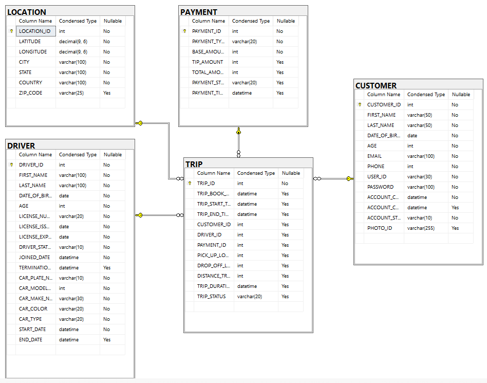

# Book A Taxi Data Model

The idea of this project is to create a simple Data model by imagining a basic Taxi service. Before we create data models, we need to identify the different data elements involved in this project.

Let's do a small exercise which helps in identifying these data element that go into our schema. Let's walkthrough a scenario where I'm booking a taxi using a Mobile app.

When the first time I installed this app on my profile, I need to create a profile for myself in order to use this app. So, let's say, all my profile information is collected during the set up and saved in a Customer table.

When I am ready to book a taxi, I will search for my destination and select that location to where I need this Taxi. Once selected, this app needs to store this destination location information. Also, this app needs my current location before showing up if any Taxis are available near me. So, let's say, both locations are stored in a Location table.

At this point, this mobile app will start showing me one or more Taxis which are available near me. Once I select a taxi, that taxi's information and it's driver information will be displayed to me. So, let's say, all the taxi and it's driver information will be saved in a Driver table.

Before confirming my trip, this app would ask for payment details. I'l go ahead and provide my credit card information for the payment. So, let's say, all payment information will be saved in a Payment table.

Now, we have all the information we need to confirm a trip. So, let's say, we save all above information in a Trip table.

